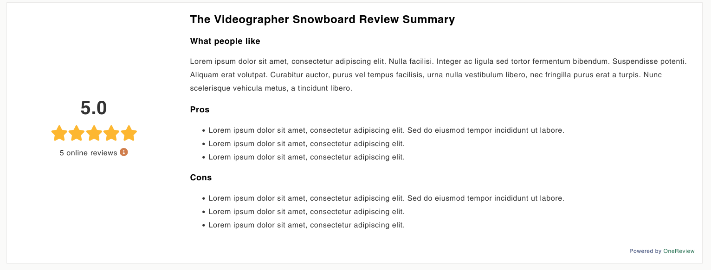

# shopify-components

Public github repo for OneReview app block code for custom implementations.

### onereview-review-summary.liquid

- should be inserted on a product template page
- depends on onereview-stars.liquid

### onereview-star-rating.liquid

- should be inserted on a product template page
- depends on onereview-stars.liquid

### onereview-collection-stars.liquid

- should be inserted on a collection template page

### onereview-stars.liquid

- should be included within the app code folder anywhere

